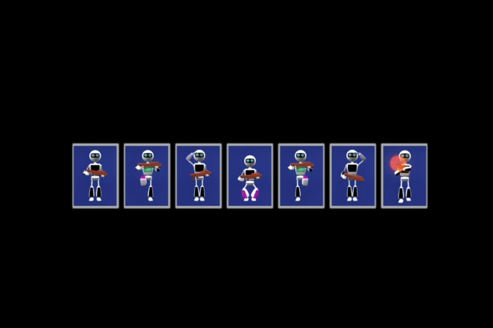

# Firing squad synchronization problem

Solution to the firing squad synchronization problem described in this udiprod YouTube video:
https://www.youtube.com/watch?v=xV1aKUdlljU

## The problem statement

There is a line of firing squad robots. We give the first robot on the left the signal. It should then communicate the order to the end of the row, and the whole squad should fire at the same time.

But there is a set of constraints: the robots can only communicate with each other with "body language"--the "pose", or state, each robot is in. And each robot can only see it's two neighbors (And the robots on either end can only see one neighbor).

