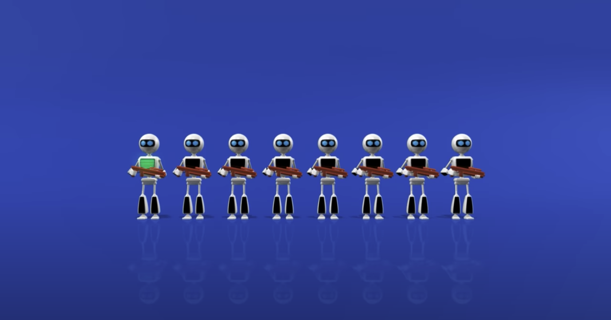
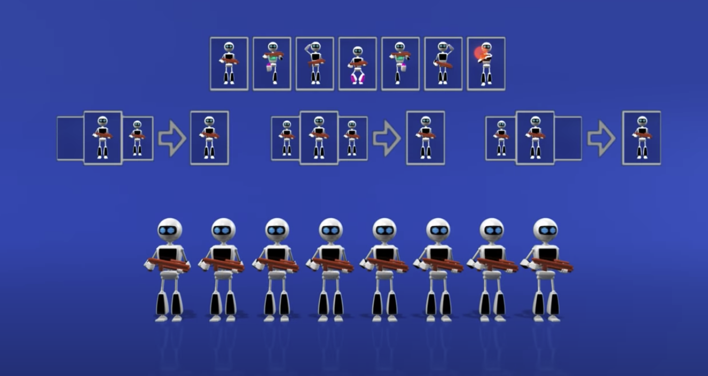
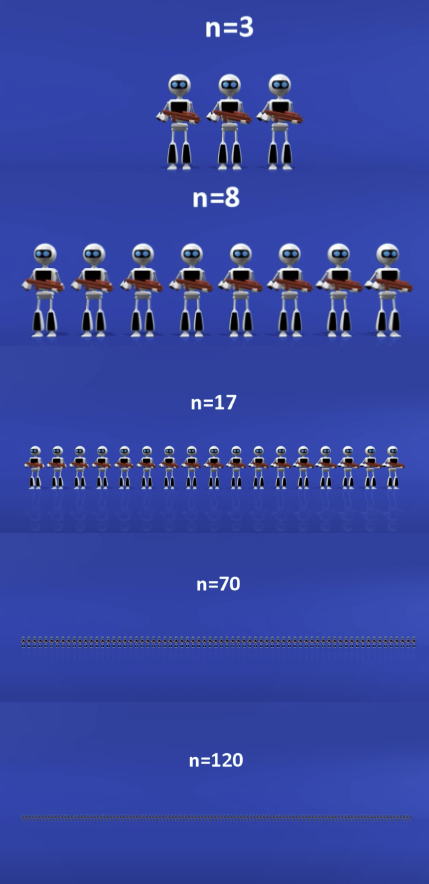

# Firing squad synchronization problem

Solution to the firing squad synchronization problem described in this udiprod YouTube video:
https://www.youtube.com/watch?v=xV1aKUdlljU

## The problem statement

There is a line of firing squad robots. We give the first robot on the left the signal. It should then communicate the order to the end of the row, and the whole squad should fire at the same time.

But there is a set of constraints: the robots can only communicate with each other with "body language"--the "pose", or state, each robot is in. And each robot can only see it's two neighbors (And the robots on either end can only see one neighbor).

Each robot changes stance on the "beat"--all at once. Each robot follows a simple set of "transition rules"--given their own state, and the state of their neighbors, the simple rules determine the state the robot will assume on the next beat. This will be a stateless, pure function, as the robots have no memory of anything that's happened before.

So every robot must have the initial, "idle" state and the "firing" state, and we may specify any additional states we need. With all robots idle, the transition rules must be such that they will remain idle into the future. When we give the first robot the signal, it will switch to the first non-idle state. The rest of our rules kick in, setting off a chain reaction.

The problem: to define a set of states and transition rules such that when we give the first robot the signal, all the robots eventually achieve the "firing" state on the same beat. And these states and rules must work for any finite number of robots.

